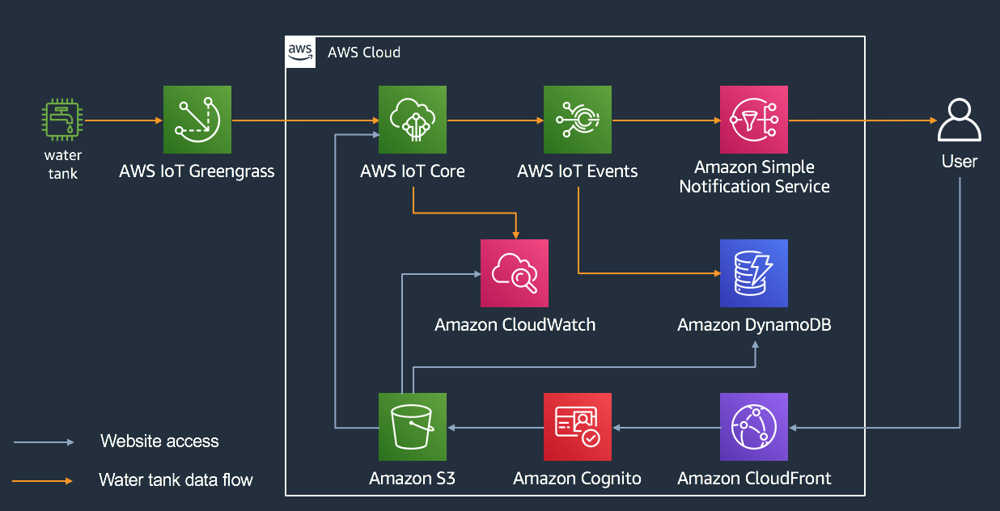

# IoT Water Tank Workshop

Monitoring remote oilfield assets has always been challenging given traditional SCADA (Supervisory Control & Data Acquisition) and network limitations. With accurate real time data, oil & gas operators can reduce operating expenses, minimize downtime, and improve safety. 

In this builder session, you will learn how to setup an edge hardware and software solution to monitor a water tank level. We will use the following AWS services: AWS IoT Greengrass, AWS IoT Core, AWS IoT Events, Amazon CloudWatch, Amazon DynamoDB and Amazon SNS.

## Overall Architecture

The picture bellow, illustrates the overall architecture of what we will be building.

    
Water Tank Data Flow

On the left hand side, you can see the water tank device. It has a tank level sensor connected to a device running AWS GreenGrass that will send telemetry data to AWS IoT Core over MQTT. Once telemetry data is received on AWS IoT Core, it will:

1. Save a **tankLevel** custom metric on Amazon CloudWatch, so that we can plot tank level values over time.
2. Pushes the data through AWS IoT Events, so we can keep track if the tank level is within acceptable thresholds or not. Whenever the tank level exceeds the maximum threshold value, it will push a notification to an Amazon SNS topic, so that subscripers to that topic can receive an e-mail or text message notification. The same is true, whenever the tank level comes back to a value below the maximum level threshold.

    
End User Experience

On the right hand side, you have a user that accesses a website running on S3 to monitor the water tank level. The website interact with 3 AWS services:

1. It subscribes to an AWS IoT Core topic, to receive live telemetry from the tank.
2. It can fetch historical water tank levels from Amazon CloudWatch logs
3. I also fetchs an Amazon DynamoDB table, to display tank level threshold events.

The animation bellow will give you an idea of what the user experience is like on that web application.

## Instructions

- [Prerequisites](docs/instructions/0-prereqs.md)
- [Lab 1 - Connecting to AWS IoT Core](docs/instructions/1-connecting-wt-iot-core.md)
- [Lab 2 - Using The Web Application](docs/instructions/2-webapp.md)
- [Lab 3 - AWS IoT Core Data Flow](docs/instructions/3-iot-core-data-flow.md)
- [Lab 4 - Setting up AWS IoT Events](docs/instructions/4-iot-events.md)
- [Lab 5 - Setting up Tank Level Notifications](docs/instructions/5-sns-notifications.md)
- [Appendix](docs/appendix/appendix.md)