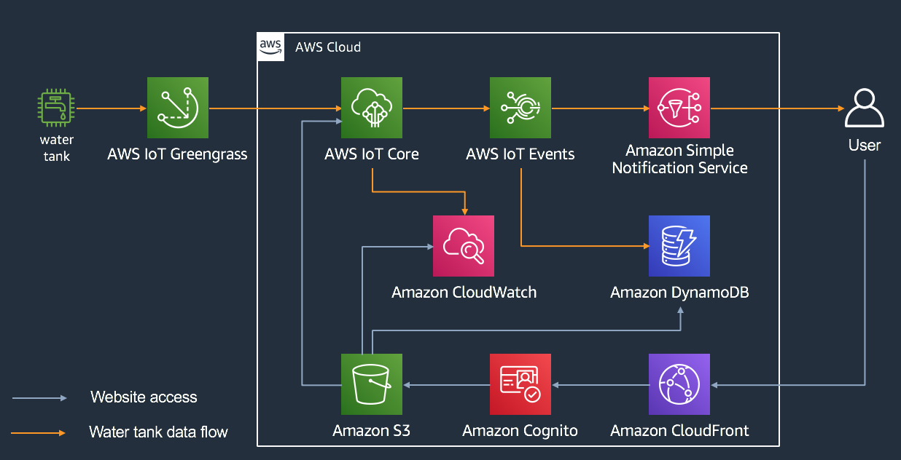

# Appendix

In this appendix, we will provide you with extra information that might be useful if you are not yet familliar with some of the AWS servicces and technologies being used in this workshop.

To make it easier to understand where most of those services fits in the overall architecture of this workshop, we are re-introducing the diagram below.

## Index

  - [Amazon CloudWatch](#amazon-cloudwatch)
  - [Amazon DynamoDB](#amazon-dynamodb)
  - [AWS IoT Core](#aws-iot-core)
  - [AWS IoT Events](#aws-iot-events)
  - [AWS IoT Greengrass](#aws-iot-greengrass)
  - [Amazon Simple Notification Service (SNS)](#amazon-simple-notification-service-sns)
  - [Amazon Simple Storage Service (S3)](#amazon-simple-storage-service-s3)
  - [Amazon CloudFront](#amazon-cloudfront)
  - [MQTT](#mqtt)

## Amazon CloudWatch

    
What is it?

[Amazon CloudWatch](https://aws.amazon.com/cloudwatch/) is a monitoring and observability service built for DevOps engineers, developers,site reliability engineers (SREs), and IT managers. CloudWatch provides you with data and actionable insights to monitor your applications, respond to system-wide performance changes, optimize resource utilization, and get a unified view of operational health.

CloudWatch collects monitoring and operational data in the form of logs, metrics, and events, providing you with a unified view of AWS resources, applications, and services that run on AWS and on-premises servers. You can use CloudWatch to detect anomalous behavior in your environments, set alarms, visualize logs and metrics side by side, take automated actions, troubleshoot issues, and discover insights to keep your applications
running smoothly.

    
How do we use it?

We use Amazon CloudWatch to record a [custom metric](https://docs.aws.amazon.com/AmazonCloudWatch/latest/monitoring/publishingMetrics.html), tankLevel, for each tank in use. We fetch the last 15 minutes of a given tank custome metric everytime we [monitor historica data on the web app](../instructions/2-webapp.md#Viewing-Historical-Data) .

## Amazon DynamoDB

    
What is it?

[Amazon DynamoDB](https://aws.amazon.com/dynamodb/) is a key-value and document database that delivers single-digit millisecond performance at any scale. It's a fully managed, multiregion, multimaster, durable database with built-in security, backup and restore, and in-memory caching for internet-scale applications. DynamoDB can handle more than 10 trillion requests per day and can support peaks of more than 20 million requests per second.

Many of the world's fastest growing businesses such as Lyft, Airbnb, and Redfin as well as enterprises such as Samsung, Toyota, and Capital One depend on the scale and performance of DynamoDB to support their mission-critical workloads.

Hundreds of thousands of AWS customers have chosen DynamoDB as their key-value and document database for mobile, web, gaming, ad tech, IoT, and other applications that need low-latency data access at any scale. Create a new table for your application and let DynamoDB handle the rest.

    
How do we use it?

We use Amazon DynamoDB to store tank level threshold events, exceeding max threshold and getting back below it. The web application fetches data from it to show the last 10 recorded events.

## AWS IoT Core

    
What is it?

[AWS IoT Core](https://aws.amazon.com/iot-core/) is a managed cloud service that lets connected devices easily and securely interact with cloud applications and other devices. AWS IoT Core can support billions of devices and trillions of messages, and can process and route those messages to AWS endpoints and to other devices reliably and securely. With AWS IoT Core, your applications can keep track of and communicate with all your devices, all the time, even when they aren’t connected.

AWS IoT Core also makes it easy to use AWS services like AWS Lambda, Amazon Kinesis, Amazon S3, Amazon SageMaker, Amazon DynamoDB, Amazon CloudWatch, AWS CloudTrail, and Amazon QuickSight, to build IoT applications that gather, process, analyze and act on data generated by connected devices, without having to manage any infrastructure.

    
How do we use it?

Each water tank publishes data to a telemetry [topic](https://docs.aws.amazon.com/iot/latest/developerguide/topics.html) and reports its state to the [device shadow service](https://docs.aws.amazon.com/iot/latest/developerguide/iot-device-shadows.html). The web application subscribes to taht same telemetry topic and fetchs data from the shadow service.

## AWS IoT Events

    
What is it?

[AWS IoT Events](https://aws.amazon.com/iot-events/) is a fully managed service that makes it easy to detect and respond to events from IoT sensors and applications. Events are patterns of data identifying more complicated circumstances than expected, such as changes in equipment when a belt is stuck or motion detectors using movement signals to activate lights and security cameras.

Before IoT Events, you had to build costly, custom applications to collect data, apply decision logic to detect an event, and then trigger another application to react to the event. Using IoT Events, it’s simple to detect events across thousands of IoT sensors sending different telemetry data, such as temperature from a freezer, humidity from respiratory equipment, and belt speed on a motor.

You simply select the relevant data sources to ingest, define the logic for each event using simple ‘if-then-else’ statements, and select the alert or custom action to trigger when an event occurs. IoT Events continuously monitors data from multiple IoT sensors and applications, and it integrates with other services, such as AWS IoT Core and AWS IoT Analytics, to enable early detection and unique insights into events. IoT Events automatically triggers alerts and actions in response to events based on the logic you define to resolve issues quickly, reduce maintenance costs, and increase operational efficiency.

    
How do we use it?

We use AWS IoT Events to keep track of each water tank state (normal or dangerous), based on their tank levels. Whenever a tank gets into a dangerous state or gets back to a normal state, we record that on an Amazon DynamoDB table and also send a notification to Amazon SNS.

## AWS IoT Greengrass

    
What is it?

[AWS IoT Greengrass](https://aws.amazon.com/greengrass/) seamlessly extends AWS to edge devices so they can act locally on the data they generate, while still using the cloud for management, analytics, and durable storage. With AWS IoT Greengrass, connected devices can run AWS Lambda functions, execute predictions based on machine learning models, keep device data in sync, and communicate with other devices securely – even when not connected to the Internet.

With AWS IoT Greengrass, you can use familiar languages and programming models to create and test your device software in the cloud, and then deploy it to your devices. AWS IoT Greengrass can be programmed to filter device data and only transmit necessary information back to the cloud. You can also connect to third-party applications, on-premises software, and AWS services out-of-the-box with AWS IoT Greengrass Connectors. Connectors also jumpstart device onboarding with pre-built protocol adapter integrations and allow you to streamline authentication via integration with AWS Secrets Manager.

    
How do we use it?

We run AWS IoT Greengrass on an edge device connected to the water tank, in order to send telemetry data to aWS IoT Core.

## Amazon Simple Notification Service (SNS)

    
What is it?

[Amazon Simple Notification Service (SNS)](https://aws.amazon.com/sns/) is a highly available, durable, secure, fully managed pub/sub messaging service that enables you to decouple microservices, distributed systems, and serverless applications. Amazon SNS provides topics for high-throughput, push-based, many-to-many messaging. Using Amazon SNS topics, your publisher systems can fan out messages to a large number of subscriber endpoints for parallel processing, including Amazon SQS queues, AWS Lambda functions, and HTTP/S webhooks. Additionally, SNS can be used to fan out notifications to end users using mobile push, SMS, and email.

    
How do we use it?

Whenever a tank level goes beyond the max threshold or back bellow it, we send a notification to an [SNS topic](https://docs.aws.amazon.com/sns/latest/dg/welcome.html). Users subscribe to those topics in order to receive e-mail or SMS notifications.

## Amazon Simple Storage Service (S3)

    
What is it?

[Amazon Simple Storage Service (Amazon S3)](https://aws.amazon.com/s3/) is an object storage service that offers industry-leading scalability, data availability, security, and performance. This means customers of all sizes and industries can use it to store and protect any amount of data for a range of use cases, such as websites, mobile applications, backup and restore, archive, enterprise applications, IoT devices, and big data analytics. Amazon S3 provides easy-to-use management features so you can organize your data and configure finely-tuned access controls to meet your specific business, organizational, and compliance requirements. Amazon S3 is designed for 99.999999999% (11 9's) of durability, and stores data for millions of applications for companies all around the world.

    
How do we use it?

We use amazon S3 to host our web application.

## Amazon CloudFront

    
What is it?

[Amazon CloudFront](https://aws.amazon.com/cloudfront/) is a fast content delivery network (CDN) service that securely delivers data, videos, applications, and APIs to customers globally with low latency, high transfer speeds, all within a developer-friendly environment. 

CloudFront is integrated with AWS – both physical locations that are directly connected to the AWS global infrastructure, as well as other AWS services. CloudFront works seamlessly with services including AWS Shield for DDoS mitigation, Amazon S3, Elastic Load Balancing or Amazon EC2 as origins for your applications, and Lambda@Edge to run custom code closer to customers’ users and to customize the user experience. Lastly, if you use AWS origins such as Amazon S3, Amazon EC2 or Elastic Load Balancing, you don’t pay for any data transferred between these services and CloudFront.

    
How do we use it?

We use Amazon CloudFront to [speed up the delivery of our web application](https://docs.aws.amazon.com/AmazonCloudFront/latest/DeveloperGuide/IntroductionUseCases.html#IntroductionUseCasesStaticWebsite).

## MQTT

    
What is it?

[MQTT](https://docs.aws.amazon.com/iot/latest/developerguide/mqtt.html) is a widely adopted, lightweight messaging protocol designed for constrained devices.

    
How do we use it?

    
We use the MQTT protocol for all communications between our water tanks and AWS IoT Core. We also use [MQTT over websockets](https://docs.aws.amazon.com/iot/latest/developerguide/mqtt-ws.html) in the communication beween our web application and AWS IoT Core.

---
[Index](../../README.md#Instructions)