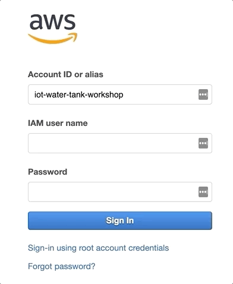

# Prerequisites
Before you start the hands-on activities, please make sure you have all the required access listed bellow.

## 1) Provide us your e-mail addres
We will collect all the attendees e-mails on the beginning of the session. Please make sure you add your e-mail to that list.

> **Note:** You will need to have access to the e-mail address you provide us in order to complete the registration steps below.

## 2) Get access to the web application
Follow these steps to access the web application:

1. After we register your e-mail, you will receive an e-mail with:
   1.  **URL:** [http://bit.ly/2019oig301](http://bit.ly/2019oig301)
   2.  **Username:** Your username will be your e-mail address.
   3.  **Password**: A temporary password.
2. Click on the web application URL link. Make sure you open it on Google Chrome or Firefox. Follow the steps bellow to sign in:
   1. Type your e-mail on the username field.
   2. Type the copy and paste the temporary password you received on your e-mail on the password field.
   3. Click **sign in**.
   4. On the change password form, type your final password and click **change**. Please note that you will need to remember that password if you sign out and want to sign in again.
   5. On the account recovery screen, click **skip**.
3. Leave the web application tab open on your browser as you will use it during this session to monitor your water tank.

## 3) Get access to the AWS account used on this workshop

You will run this workshop on a test AWS account we will provide. Please follow the steps bellow to access the AWS console:

Access the AWS console at [https://iot-water-tank-workshop.signin.aws.amazon.com/console](https://iot-water-tank-workshop.signin.aws.amazon.com/console). On the **IAM user name** field, type the e-mail address you provided us. On the **Password** field, type your temporary password, **OIG301**. Click **Sign In**.

You will be asked to change your password. On the **Old password** field, type your temp password: **OIG301**. On the **New password** field, type your new password. On the **Retype new password** field, retype your new password. Click **Confirm password change**.

---
[<- Index](../../README.md#Instructions)&nbsp;&nbsp;&nbsp;&nbsp;&nbsp;&nbsp;&nbsp;&nbsp;&nbsp;&nbsp;[-> Lab 1 - Connecting to AWS IoT Core](1-connecting-wt-iot-core.md)

