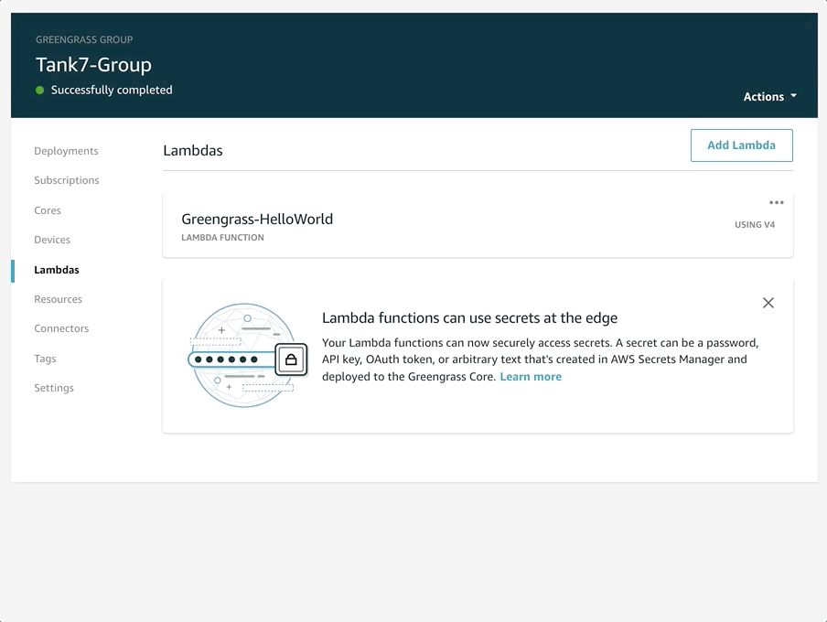

# Lab 1 - Enabling Greengrass device to publish telemetry to AWS IoT Core


## Device Preparation

Before turning on the Moxa demo unit, ensure that the eTape Liquid Level Sensor is plugged into the provided connection cable.


Make sure the local network cable is plugged into the top ethernet port (eth0), and that the ethernet cable provided with the Moxa demo unit (connected to the Moxa ioLogik E1242 device) is plugged into the bottom ethernet port (eth1).


Make sure the Moxa demo unit is plugged into a power source, and turn on the red power switch located at the top-right of the unit.

PICTURE-OF-POWER-BUTTON

## Access the AWS Management Console

Use the provided login URL to access the console sign-on web page.  Using the provided credentials, type in the **IAM user name** and **password**, and click the **Sign In** button.


You should now see the AWS Management Console home page.


## Find your Greengrass Group

On the AWS Management Console home page, type **greengrass** into the **Find Services** search bar.  Click the **IoT Greengrass** item (the first query result).


You should now be in the AWS IoT portal.  Under **Greengrass** in the left hand menu, click **Groups**.  Next, click the group card labeled with your tank number (i.e. Tank1-Group).


You should land on your Greengrass group's deployments page.


## Examine Greengrass Group Configuration

On the left-hand pane, click **Lambdas**.  This view indicates which Lambda functions are configured to be deployed to your edge device.  You should see a function named **Greengrass-HelloWorld** (version number does not matter).


Next, click **Subscriptions** on the left-hand pane.  This view shows the allowed paths for MQTT communication on the edge device. You should see one entry - a subscription with a source of **Greengrass-HelloWorld**, target of **IoT Cloud**, and a topic of **hello/world/Tank{Number}**.



On the left-hand pane, click **Deployments**. In the next section, you will deploy this Greengrass Group configuration to your edge device.


## Deploy Greengrass Configuration v1

In the top-right corner of the **Deployments** view, click the **Actions** drop down, and click **Deploy**. You should see a green notification message, with the message '*Started Greengrass Group deployment*'.

After starting a deployment, you should see a new deployment item appear under the **Group history overview** grid.  Your deployment will start with an '*Is Pending*' status (gray circle), progress to '*In Progress*' status (yellow circle), and finally end with '*Successfully completed*' status (green circle).

> Note: If your deployment results with a '*Failed*' status (red circle), please notify the event staff to troubleshoot.


## MQTT Test - hello/world

After confirming a '*Successfully completed*' status for your Greengrass Group deployment, open a new browser tab, and access the AWS Management Console.

On the AWS Management Console home page, type **iot core** into the **Find Services** search bar.  Click the **IoT Core** item (the first query result).


You should now be in the AWS IoT portal.  Click **Test** in the left hand menu.  Under **Subscription topic**, enter hello/world/Tank{NUMBER}, where {NUMBER} is your assigned tank number (i.e. hello/world/Tank1).

You should now see messages displayed every 5 seconds, coming from your device.  This is a simple hello world message - next, you will configure another Lambda function to publish datapoints captured from the liquid tape sensor.


## Edit Greengrass Function Definition

In the AWS Management Console home page, type **greengrass** into the **Find Services** search bar.  Click the **IoT Greengrass** item (the first query result).

You should now be in the AWS IoT portal.  Under **Greengrass** in the left hand menu, click **Groups**.  Next, click the group card labeled with your tank number (i.e. Tank1-Group).

After navigating back to your Greengrass group, click **Lambdas** in the left-hand pane.  Click **Add Lambda** in the right-hand corner, and then **Use existing Lambda** in the next prompt.  Search/select the Lambda function pre-built for your edge device, named **Tank#-GreengrassLambdaFunction**.  You should see this function uses **Python 3.7** runtime. Click **Next**.  Select the latest version for this function, and click **Finish**.


You should land in the **Lambdas** view for your Greengrass Group, and see your newly added function listed.  Click **...** in the top right-hand corner of your new function, and click **Edit configuration**.


In the **Group-specific Lambda configuration** view, ensure your Lambda has the following configuration:

* Run as: **Use group default (currently: ggc_user/ggc_group)**
* Containerization: **No container (always)**
* Timeout: **25 Second**
* Lambda lifecycle: **Make this function long-lived and keep it running indefinitely**
* Input payload data type: **JSON**
* Environment variables:

Key  | Value
------------- | -------------
ADDRESS  | 524
THING_NAME  | Tank#
SENSOR_MIN | #.#####
SENSOR_MAX | #.#####

Click **Update**.  Then click the back arrow in the top-left corner of the portal to return back to your Greengrass group homepage.

## Edit Greengrass Subscription Definition

After navigating back to your Greengrass group, click **Suscriptions** in the left-hand pane.  Then lick **Add Subscription** in the right-hand corner.

First, select a source.  Click the gray box under **Select a source**, and choose your recently configured Lambda function from the **Lambdas** tab.

Next, select a target.  Click the gray box under **Select a target**, and choose **IoT Cloud**.  Click **Next**.

In the **Filter your data with a topic** view, enter your topic filter: **tanks/Tank#/telemetry**.  Click **Next**, check your selection summary, and click **Finish**.


## Deploy Greengrass Configuration v2

In the top-right corner of the **Deployments** view, click the **Actions** drop down, and click **Deploy**. You should see a green notification message, with the message '*Started Greengrass Group deployment*'.

After starting a deployment, you should see a new deployment item appear under the **Group history overview** grid.  Your deployment will start with an '*Is Pending*' status (gray circle), progress to '*In Progress*' status (yellow circle), and finally end with '*Successfully completed*' status (green circle).

> Note: If your deployment results with a '*Failed*' status (red circle), please notify the event staff to troubleshoot.


## MQTT Test - Sensor telemetry

After confirming a '*Successfully completed*' status for your second Greengrass Group deployment, open a new browser tab, and access the AWS Management Console.

On the AWS Management Console home page, type **iot core** into the **Find Services** search bar.  Click the **IoT Core** item (the first query result).

You should now be in the AWS IoT portal.  Click **Test** in the left hand menu.  Under **Subscription topic**, enter ***tanks/Tank#/telemetry***.

You should now see messages displayed every 15 seconds, coming from your device.  The message should have the following schema:

```
{
  "telemetry": [
    {
      "tankLevel": FLOAT,
      "sensorValue": FLOAT,
      "recorded_at": TIMESTAMP
    }
  ]
}
````


---
[<- Prerequisites](0-prereqs.md)&nbsp;&nbsp;&nbsp;&nbsp;&nbsp;&nbsp;&nbsp;&nbsp;&nbsp;&nbsp;[-> Lab 2 - Using The Web Application](2-webapp.md)