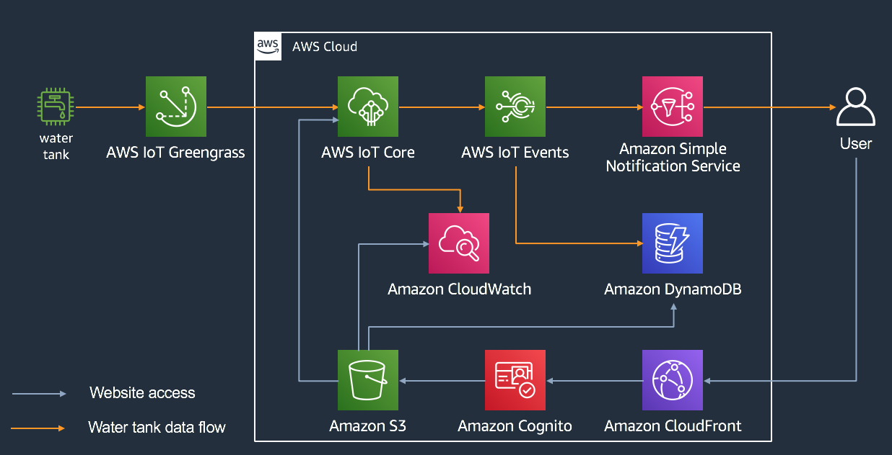
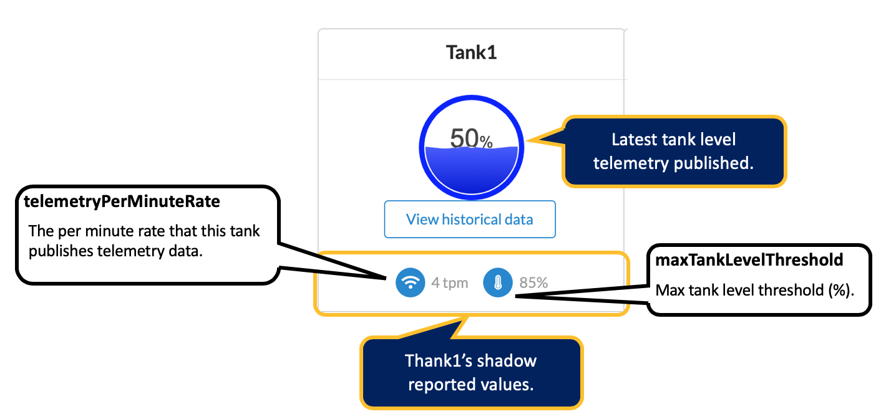
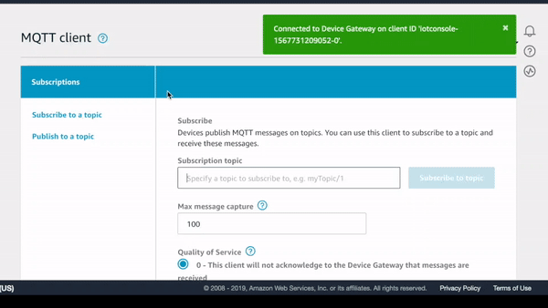
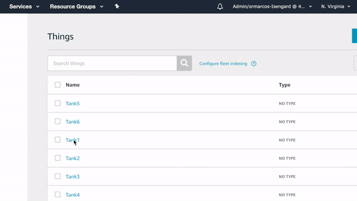
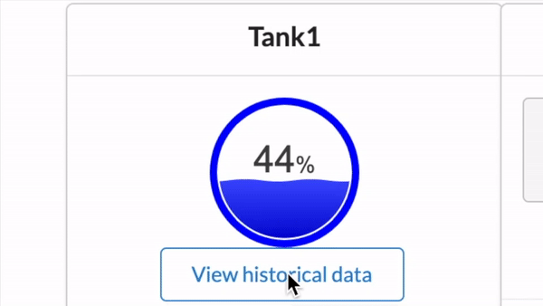

# Lab 2 - Using The Web Application
It is very common on real IoT usecases to have a web and/or mobile application that allow your users to monitor your IoT devices. In this workshop, you will be using the web application to monitor your water tank.

> **Note:** In fact, if you want, you will be able to see data for any tank being used by other attendees on this builder session. For documentation purpose, we will assume we are monitoring **Tank1**. If you are using another tank, please replace any occurances of **Tank1** by your tank name. 

## Overall Architecture
The picture bellow, illustrates the overall architecture of how this web application interacts with AWS services.



## Web Application Overview
This is a ReacJS web application running on S3, behind a CloudFormation distribution. It also uses Amazon Cognito for authentication and authorization.

After you login, this application will show you a list of water tanks currently provisioned on AWS IoT Core. For each tank, it will:

1. **Display the reported thing shadow state:** After you connected your tank to AWS IoT Core on the previous lab, you tank is reporting its state to the corresponding thing shadow. Each tank, report 2 variables to the shadow:
   1. **Telemetry Rate:** Each tank is configured to send telemetry data every 15 seconds. Therefore, the telemetry rate is 4 tpm (telemetry pushes per minute). So, every 15 seconds, each tank publishes the last 15 values (one per second) of its tank level (in %).
   2. **Maximum Tank Level Threshold**: Whenever we use any kind of fluid tanks in the field, we want to make sure that the tank levels are within safe threshold values. For this session, we have all the tanks configure with a max tank level threshold set to 85%.
2. **Latest Tank Level**: When you load web app, it subscriber to the corresponding AWS IoT topic that the tanks are publishing telemetry to (tanks/Tank1/telemetry for Tank1). So, every 15 seconds (when your tank is publishing telemetry data) the web app that is subscribing to that topic is receiving live updates and rendering that on the page.

The picture bellow illustrates how we display the reported thing shadow state and lates telemetry data:




## Monitoring Real-Time Telemetry
You can check that payload your tank is sending to AWS IoT Core by using the AWS Console. To do that, please follow these steps:

1. Open a new tab in your browser and go to the [Test section on the AWS IoT Core console](https://us-east-1.console.aws.amazon.com/iot/home?region=us-east-1#/test).
2. On **Subscription topic** field, type **tanks/Tank1/telemetry** and click **Subscribe to topic**.
3. Assuming your tank is connected, it should take up to 15 seconds before you can see the telemetry payload.



The telemetry payload sent by each tank is basically a json document, with a telemetry object being an array of ojects with two fields:

1. **recorded_at**: The epoch/unix timestamp that what value was recorded at.
2. **tankLevel**: The tank level reading on that timestamp, in percentage.

<details>
  <summary>Click here to view a sample telemetry payload.</summary>

  ```json
      {
        "telemetry": [
          {
            "recorded_at": 1567730411459,
            "tankLevel": 50
          },
          {
            "recorded_at": 1567730412466,
            "tankLevel": 50
          },
          {
            "recorded_at": 1567730413470,
            "tankLevel": 50
          },
          {
            "recorded_at": 1567730414472,
            "tankLevel": 50
          },
          {
            "recorded_at": 1567730415475,
            "tankLevel": 50
          },
          {
            "recorded_at": 1567730416475,
            "tankLevel": 50
          },
          {
            "recorded_at": 1567730417479,
            "tankLevel": 50
          },
          {
            "recorded_at": 1567730418483,
            "tankLevel": 50
          },
          {
            "recorded_at": 1567730419484,
            "tankLevel": 50
          },
          {
            "recorded_at": 1567730420487,
            "tankLevel": 50
          },
          {
            "recorded_at": 1567730421490,
            "tankLevel": 50
          },
          {
            "recorded_at": 1567730422494,
            "tankLevel": 50
          },
          {
            "recorded_at": 1567730423495,
            "tankLevel": 50
          },
          {
            "recorded_at": 1567730424495,
            "tankLevel": 50
          }
        ]
      }
  ```

</details>

## Monitoring Thing's Shadow
The way the water tank logic was implemented, was to report its shadow state once it starts running and that is it. Those values don't change after that.

You can check your tank's shadow by following these steps:

1. Go to the [things list on the AWS IoT Core console](https://us-east-1.console.aws.amazon.com/iot/home?region=us-east-1#/thinghub).
2. Click on **Thing1**.
3. Click on **Shadow**.
4. You should see under **shadow state** 2 fields under r**eported** values: **telemetryPerMinRate** and **maxTankLevelThreshold**. Those values should match what you see on the web application.



## Viewing Historical Data
It is nice to be able to see the actual tank level for any specific time, but what if we want to see historical data about the tank level changed over time? For that, we need to persist each tank telemetry on some sort of persistent layer. That could be a relational, object or time-series database, just to name a fiew options.

For this demo, we used Amazon CloudWatch to store a custom tankLevel metric. Every time a tank publishes telemetry data to IoT Core, we leverage an AWS IoT Rule to record those values as a custom metric on Amazon CloudWatch.

To see historical data for a given tank, follow these steps:

1. Go to the web application page, and click the **View Historical Data** button for your given tank.
2. A modal window will open. The app will then fetch the last *15 minutes* of tankLevel metric for the given tank from Amazon CloudWatch and plot it on a chart on the screen.
3. Whenever new telemetry is published by the tank to AWS IoT Core, since our app is subscribing to that topic, it will receive the updates and refresh the chart every 15 seconds.



## Tank Level Thresholds Events
The web application can also show the last 10 tank level threshold events. By events we mean, tank level exceeding the maximum threshold of **85%** or going back bellow it.

We will cover it later on Lab 5.

## Recap: Overall User Experience
The picture below illustrates the overall user experience for the web application:


---
[<- Lab 1 - Connecting to AWS IoT Core](1-connecting-wt-iot-core.md)&nbsp;&nbsp;&nbsp;&nbsp;&nbsp;&nbsp;&nbsp;&nbsp;&nbsp;[-> Lab 3 - AWS IoT Core Data Flow](3-iot-core-data-flow.md)
