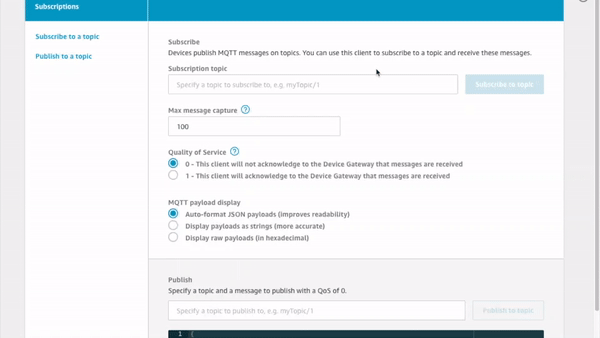

# Lab 3 - AWS IoT Core Data Flow
On this lab, we want to focus on how we are processing the telemetry data being published by the water tanks to AWS IoT Core. 

> **Note**: For documentation purpose, we will assume we are monitoring **Tank1**. If you are using another tank, please replace any occurances of **Tank1** by your tank name. 

## Architecure
The picture bellow, illustrates how we are processing each tank telemetry data as they are pushed to AWS IoT Core.


> **Note:** We are highlighting the MQTT topics that we will be inspecting on this lab.

When each tank published its telemetry data every 15 seconds, we process that data in the following order:

<details>
    <summary>tanks/+/telemetry</summary>

As you saw on [Lab 1](1-connecting-wt-iot-core), each tank sends 15 datapoints every 15 seconds to the **tanks/+/telemetry** MQTT topic.

On AWS IoT Core, we have 2 AWS IoT rules:
1. The first one, forwards that telemetry data to the **PutMetricData** AWS Lambda function that will publish all the datapoints as an Amazon CloudWatch custom metric. You can see the last 15 minutes of that metric on the web application, as described on [Lab2](2-webapp#Viewing-Historical-Data).
2. The second one, forwards that telemetry data to the **RepublishTankTelemetry** AWS Lambda function that gets the **last** data point on that set and republishes it to the **tanks/+/checkThresholds**  MQTT topic.
</details>

<details>
    <summary>tanks/+/checkThresholds</summary>

This MQTT topic has an AWS IoT rule that sends that information to AWS IoT Events. On [Lab 4](4-iot-events.md), we will setup AWS IoT Evets to keep track of the tank state.
</details>

<details>
    <summary>tanks/+/tankLevelEvent</summary>

On [Lab 4](4-iot-events.md), we will setup AWS IoT Events to detect the tank status and publish it to this MQTT topic.
</details>

## Step 1) Inspecting Message Payloads on MQTT Topics
Lets inspect the message payload on the **tanks/+/telemetry** and **tanks/+/checkThresholds** MQTT topics (we will check **tanks/+/checkThresholds** on [Lab 4](4-iot-events.md)).

You can check the message payloads by using the AWS IoT Core Console. To do that, please follow these steps:

1. Open a new tab in your browser and go to the [Test section on the AWS IoT Core console](https://us-east-1.console.aws.amazon.com/iot/home?region=us-east-1#/test).
2. On **Subscription topic** field, type **tanks/Tank1/+** and click **Subscribe to topic**.
3. Assuming your tank is connected, it should take up to 15 seconds before you can see the telemetry payload on **tanks/Tank1/telemetry**. A few seconds after that, you should also see a message published on **tanks/Tank1/checkThresholds**. You can notice by the message timestamps that a message arrives forst on **tanks/Tank1/telemetry** and then it is republished to **tanks/Tank1/checkThresholds**.



Bellow you can see a sample payload that you will see on those MQTT topics:

<details>
    <summary>tanks/Tank1/telemetry</summary>

```json
{
  "telemetry": [
    {
      "recorded_at": 1568745296802,
      "tankLevel": 50
    },
    {
      "recorded_at": 1568745297813,
      "tankLevel": 50
    },
    {
      "recorded_at": 1568745298816,
      "tankLevel": 50
    },
    {
      "recorded_at": 1568745299821,
      "tankLevel": 50
    },
    {
      "recorded_at": 1568745300825,
      "tankLevel": 50
    },
    {
      "recorded_at": 1568745301829,
      "tankLevel": 50
    },
    {
      "recorded_at": 1568745302833,
      "tankLevel": 50
    },
    {
      "recorded_at": 1568745303836,
      "tankLevel": 50
    },
    {
      "recorded_at": 1568745304841,
      "tankLevel": 50
    },
    {
      "recorded_at": 1568745305846,
      "tankLevel": 50
    },
    {
      "recorded_at": 1568745306846,
      "tankLevel": 50
    },
    {
      "recorded_at": 1568745307849,
      "tankLevel": 50
    },
    {
      "recorded_at": 1568745308851,
      "tankLevel": 50
    },
    {
      "recorded_at": 1568745309856,
      "tankLevel": 50
    }
  ]
}
```
</details>

<details>
    <summary>tanks/Tank1/checkThresholds</summary>

```json
{
  "tankId": "Tank1",
  "sensorData": {
    "tankLevel": 50,
    "recorded_at": 1568745309856
  }
}
```
>Note: The recorded_at and tankLevel fields match exactly the ones on the last datapoint that arrives at **tanks/Tank1/telemetry**.
</details>

---
[<- Lab 2 - Using The Web Application](2-webapp.md)&nbsp;&nbsp;&nbsp;&nbsp;&nbsp;&nbsp;&nbsp;&nbsp;&nbsp;[-> Lab 4 - Setting up AWS IoT Events](4-iot-events.md)