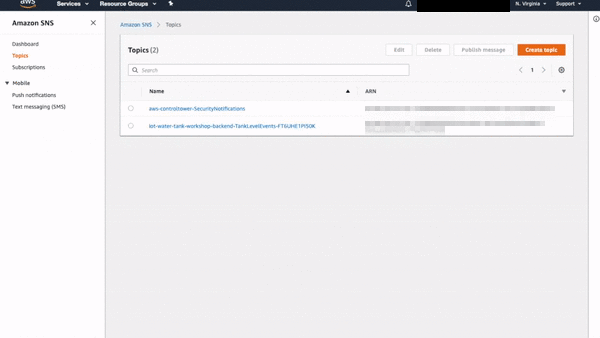

# Lab 4 - Setting up AWS IoT Events

AWS IoT Events is a fully managed service that makes it easy to detect and respond to events from IoT sensors and applications. Before IoT Events, you had to build custom applications to collect data, apply decision logic to detect an event, and then trigger another application to react to the event. 

## Architecure

The picture bellow highlighs the building blocks we will be working with on this lab.


You will leverage AWS IoT Events to create custom conditional logic to monitor your tank level. Whenever the tank level exceeds the maximum threshold value, your logic will push a notification to an Amazon SNS topic, so that subscripers to that topic can receive an e-mail or text message notification. The same is true, whenever the tank level comes back to a value below the maximum level threshold.

## Step 1) Create an AWS IoT Even Detector Model

For time constraints reasons, you will not create the detector model from scratch. You will leverage an existing template and edit it to create your detector model.

<details>
    <summary>1. Exporting the detector model template (click for details).</summary>


1. Open a new tab in your browser and go to the [IoT Events Detector models page](https://us-east-1.console.aws.amazon.com/iotevents/home?region=us-east-1#/detectormodel).
2. On the **Detector models** table, click the radio button to the left of the **TankLevelThresholds** detector model and then click **Actions**>**Export detector model**.
3. A pop up dialog will show up, click **Export** and save it as a file on your computer and close the pop up dialog.
</details>

<details>
    <summary>2. Editing exported detector model file (click for details).</summary>


1. Open the file, replace every occurence of **input.tankLevel** for **input.Tank1** and save it.

> **Note:** For documentation purpose, we will assume you are monitoring **Tank1**. If you are using another tank, please use your tank name. For example, if you are working on **Tank2**, you will replace every occurence of **input.tankLevel** for **input.Tank2**.
</details>

<details>
    <summary>3. Importing detector model (click for details).</summary>

> **Note:** For documentation purpose, we will assume you are monitoring **Tank1**. If you are using another tank, please replace any occurances of **Tank1** by your tank name.


1. Go back to the [IoT Events Detector models page](https://us-east-1.console.aws.amazon.com/iotevents/home?region=us-east-1#/detectormodel). On the **Detector models** table, click **Actions**>**Import detector model**
2. A pop up dialog will show up, click **Import**, select the file you edited and click open.
3. On the top right corner of the screen, click **Publish**.
4. A pop up dialog will open. Change the **Detector model name** from TankLevelThresholds to **Tank1** and click **Save and publish**.
5. On the top right corner of the screen, click **Publish**. You will be redirected to the main detector models screen.
</details>

<details>
    <summary>4. Checking your tank state (click for details).</summary>

> **Note:** For documentation purpose, we will assume you are monitoring **Tank1**. If you are using another tank, please click on the appropriate tank link.
> 


1. On the **Detector models** table, click on **Tank1** link on the **Name** column.
2. On the **Detectors** panel, you should see your tank state up in up to 15 seconds.
3. Click on **Tank1** under the **Key value** column. You will then be able to see more information about your tank on the **Variables** panel.
</details>


## Step 2) Understanding The Detector Model
Now that you created the detector model for your tank, lets take a minute to understand its logic. The picture bellow illustrates your detector model implementation:


<details>
    <summary>1. Your detector model has 3 states: Initializing, Normal and Dangerous (click for details).</summary>

1. **Initializing:** After you publish your detector mode, whenever it receives the first input data, it will go to the initializing state. The state has 2 events:
   1. **OnEnter:** Whenever the detector model enters this state, it initializes the following variables:
      1. **maxThreshold:** set to 85(%).
      2. **maxThresholdExceeded:** set to false.
      3. **tankLevel:** set to whatever tankLevel we are receiving as input from the tank.
   2. **OnIput:** Whenever we are on that state and receive new inputs, we set the **tankLevel** variable to the value we are receiving from the tank.
2. **Normal:** This is the state that the water tank should be whenever its **tankLevel** is not greater than **maxThreshold** (85%). This state has 3 events:
   1. **OnEnter:** Whenever we enter the into the normal state coming from the dangerous state (not the initializing state), we publish a message into **tanks/Tank1/tankLevelEvent** so that we can record that event into DynamoDB and send an SNS notification for subscribed users.
   2. **OnInput:** Whenever we receive new data from the tanks, we set the following variables:
      1. **tankLevel:** set to whatever tankLevel we are receiving as input from the tank.
      2. **maxThresholdExceeded:** set to true if the tank level that we are receiving from the water tank is greater than **maxThreshold** (85%). Otherwise we set it to false.
3. **Dangerous:** This is the state that the water tank should be whenever its **tankLevel** is greater than **maxThreshold** (85%). This state has 3 events:
   1. **OnEnter:** Every single time we enter this state, we publish a message into **tanks/Tank1/tankLevelEvent** so that we can record that event into DynamoDB and send an SNS notification for subscribed users.
   2. **OnInput:** Whenever we receive new data from the tanks, we set the following variables:
      1. **tankLevel:** set to whatever tankLevel we are receiving as input from the tank.
      2. **maxThresholdExceeded:** set to false if the tank level that we are receiving from the water tank is less than or equal to **maxThreshold** (85%). Otherwise we set it to false.
</details>
<details>
    <summary>2. And 3 transition events: normal, thresholdExceeded and backToNormal (click for details).</summary>

1. **normal**: Whenever we enter the **Initializing** state, we will initialize the variables and always transition to the **Normal** state.
2. **thresholdExceeded:** While in the **Normal** state, whenever the **thresholdExceeded** variable is **true**, we move into the **Dangerous** state.
3. **backToNormal:** While in the **Dangerous** state, whenever the **thresholdExceeded** variable is **false**, we move into the **Normal** state.
</details>

<details>
   <summary>3. Now that you understand how your detector model works, take a minute to investigate it (click for details).</summary>

   > **Note:** For documentation purpose, we will assume you are monitoring **Tank1**. If you are using another tank, please click on the respective tank link.

   

   1. Open a new tab in your browser and go to the [IoT Events Detector models page](https://us-east-1.console.aws.amazon.com/iotevents/home?region=us-east-1#/detectormodel).
   2. Click **Tank1** on the Name colum and then click **Edit** on the top right.
   3. You should be able to cick the states and transition events and inspect the actions on the form on the right.
   4. When you are done, click on the menu item on the top left and then **Detector models** to make sure you don't apply any changes to your model.
</details>


## Step 3) Setup SNS Subscriptions

Before you can receive text or e-email notifications, you need to make sure you subsribe to the SNS topic. Please follow the following steps to subscribe to **Tank1** notifications:



1. Open a new tab in your browser and go to the [SNS topics page](https://console.aws.amazon.com/sns/v3/home?region=us-east-1#/topics).
2. Click on the link on the **Name** column for the SNS topic with the name starting with **iot-water-tank-workshop-backend-TankLevelEvents-**.
3. On the **Subscriptions** tab, click on **Create subscription**.

Now you must choose what type of subscription you want to create:

<details>
   <summary>1. Create an e-mail subscription (click for details).</summary>

   > **Note:** For documentation purpose, we will assume you are monitoring **Tank1**. If you are using another tank, please use your tank name.

   1. On the **Protocol** field, select **Email.**.
   2. On the **Endpoint** field, type a valid e-mail that you can access during this lab.
   3. Since this SNS topic will receive notifications for all the water tanks on this workshops, you want to use a subscription filter polict, so you only receive notifications for Tank1. In order to do that, expand the **Subscription filter policy** panel and type the text bellow on the **JSON editor**:
   ```json
   {
     "tankId": ["Tank1"]
   }
   ```
   4. Click **Create subscription**.
   5. <details>
         <summary>Make sure you check your e-mail and confirm the subscription (click for details).</summary>

         

         1. Your subscription will show up the a **Pending confirmation** status. To confirm the subscription, check your email inbox for an email from **AWS Notifications** with the title **AWS Notification - Subscription Confirmation**.
         2. Open that e-mail and click on the **Confirm subscription** link. You should see a web page saying **Subscription confirmed!**.
         3. Get back to the aws console listing all the subscriptions and refresh the page on your browser. Your subscruptions should now show a **Confirmed** status.
      </details>
</details>
   
<details>
   <summary>2. Create a SMS subscription (click for details).</summary>

   

   > **Note:** For documentation purpose, we will assume you are monitoring **Tank1**. If you are using another tank, please use your tank name.

   1. On the **Subscriptions** tab, click on **Create subscription**.
   2. On the **Protocol** field, select **SMS.**.
   3. On the **Endpoint** field, type a valid mobile number that can receive notifications from Amazon SNS.
   4. Since this SNS topic will receive notifications for all the water tanks on this workshops, you want to use a subscription filter polict, so you only receive notifications for Tank1. In order to do that, expand the **Subscription filter policy** panel and type the text bellow on the **JSON editor**:
   ```json
   {
     "tankId": ["Tank1"]
   }
   ```
   5. Click **Create subscription**.
</details>

## Step 4) Triggering Notifications
Now, all you have to do is to change the tank level in order to trigger the notification. Please do the following:

> **Note:** For documentation purpose, we will assume you are monitoring **Tank1**. If you are using another tank, please make sure you monitor your tank on the web app.

1. Open the web application on your browser and keep an eye on it, so you can monitor the **Tank1** level.
2. Fill up the tank slowly. As you feel it up, you should see the **Tank1** level widget change th tank level value. Please note that telemetry is sent every 15 seconds, so it can take up to 15 seconds for the new tank level value to reflect on the web app.
3. Once the tank level is **greater than 85%**, the web application should render the widget in red and you should receive a (SMS or e-mail) notification.
4. Drain the tank slowly. As you drain it, you should see the **Tank1** level widget change th tank level value. Please note that telemetry is sent every 15 seconds, so it can take up to 15 seconds for the new tank level value to reflect on the web app.
5. Once the tank level is **less or equal to 85%**, the web application should render the widget in red and you should receive a (SMS or e-mail) notification.
6. If you cliek on **View historical data** for your tank, you should be able to see:
   1. A chart with the last 15 minutes of tank level chages over time.
   2. A table logging every tank level **dangerous** or **back to normal** events.

The videos bellow will give you an idea on how to use the web application to monitor the tank and check for notifications:

<details>
   <summary>1. Change the tank level to trigger the notifications (click for details).</summary>

   
</details>

<details>
   <summary>2. Check your e-mail for tank level notifications (click for details).</summary>

   
</details>

<details>
   <summary>3. Check your phone for text message notifications (click for details).</summary>

   
</details>


---
[<- Lab 3 - AWS IoT Core Data Flow](3-iot-core-data-flow.md)&nbsp;&nbsp;&nbsp;&nbsp;&nbsp;&nbsp;&nbsp;&nbsp;&nbsp;[-> Appendix](../appendix/appendix.md)